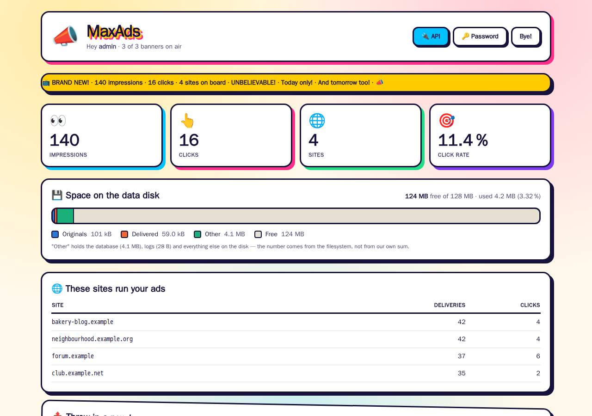
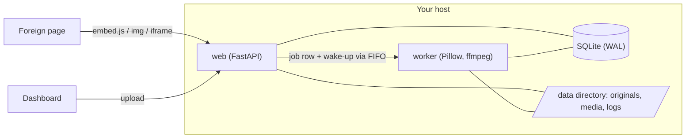

# MaxAds

**Self-hosted banner ads: upload an image or video, get it web-optimised, embed
it anywhere with one line, and count impressions and clicks without storing a
single IP address.**



A small service for running your own banners on your own and friendly sites —
no ad network, no third-party tracking. It is deliberately boring to operate:
one Python web process, one media worker, SQLite, and a data directory.

## Features

- **Upload and forget.** Images become WebP (animated GIFs stay animated), videos
  become H.264/AAC with the index moved to the front. If transcoding would make
  an already browser-ready file bigger, the original wins.
- **Five ways to embed:** a script that reserves the aspect ratio (no layout
  jump on the host page), the same with width/alignment/radius options, an
  iframe, a plain `` for places that strip JavaScript, and JSON for your own
  integration. `random` works wherever a banner id goes.
- **Honest counting.** An impression is counted once the banner has actually
  been on screen (`IntersectionObserver`), once per visitor, banner and day.
  Visitors are told apart by a daily-rotating hash — the next day the same
  visitor is unrecognisable, and no raw IP ever reaches the database.
- **Which sites run your ads,** counted on every request (not only on counted
  impressions), without your own host or test pages.
- **Quiet when idle.** The worker sleeps on a pipe instead of polling, log lines
  are buffered, and a mount guard stops the service from writing into an empty
  directory when its data disk drops out.
- **Small team accounts.** No public sign-up: the first admin is created at
  start-up, further accounts from the dashboard.

## Quick start

```bash
cp .env.example .env
docker compose up -d --build
docker compose logs web | grep "First admin"   # the generated password, shown once
```

Open <http://localhost:8080>, log in as `admin` with that password and choose a
new one — MaxAds asks for it on the first login. To pick the first password
yourself, set `MAXADS_ADMIN_PASSWORD` in `.env` before the first start.

For a public setup, put the service behind a reverse proxy with TLS and set
`MAXADS_PUBLIC_URL` (e.g. `https://ads.example.com`) — the embed snippets point
there. Running it without Docker: [docs/deploy/systemd.md](docs/deploy/systemd.md).

## Embedding

```html
<!-- one specific banner -->
<script src="https://ads.example.com/embed/<id>.js" async></script>

<!-- a random active banner, max. 300 px wide, left-aligned, rounded corners -->
<script src="https://ads.example.com/embed/random.js?width=300&align=left&radius=12" async></script>

<!-- iframe -->
<iframe src="https://ads.example.com/frame/<id>"
        style="width:100%;aspect-ratio:16/9;border:0" loading="lazy"></iframe>

<!-- no JavaScript at all: the request itself counts as the impression -->
<a href="https://ads.example.com/c/<id>">" alt="Advertisement"></a>
```

The dashboard shows the ready-to-copy code for every banner, and `/api` lists
all endpoints.

## How it works



The web process never transcodes: a video takes minutes and would block
requests and get lost on every restart. Uploads become a row in a job table;
the worker claims it with an atomic `UPDATE … WHERE state='pending'` and is woken
through a FIFO in `/run`. The decisions behind this — and a few traps they avoid,
such as H.264 files that play in VLC but hang forever in Chrome — are in
[docs/ARCHITECTURE.md](docs/ARCHITECTURE.md).

### Measured, not guessed

On the original deployment, idle for 60 s:

| | idle |
|---|---|
| disk accesses | **0** — the kernel page cache absorbs everything |
| worker CPU | 0.0 ms |
| web CPU | ~50 ms (0.08 % of one core) |
| memory | web ~33 MB, worker ~14 MB |

## Tech stack

Python 3.13 · FastAPI · Jinja2 · SQLite · Pillow · ffmpeg · argon2 · Docker /
systemd · Tailwind (Play CDN, see the open issue).

## Development

```bash
python3.13 -m venv .venv && . .venv/bin/activate
pip install -r requirements-dev.txt
python -m pytest -q        # install ffmpeg, or the two video tests skip themselves
python -m ruff check .
```

Run it locally without Docker:

```bash
export MAXADS_BASE=/tmp/maxads MAXADS_REQUIRE_MOUNT=0 RUNTIME_DIRECTORY=/tmp/maxads-run
uvicorn app.main:create_app --factory --reload &
python -m app.worker
```

See [CONTRIBUTING.md](CONTRIBUTING.md) for conventions and the pre-commit secret
guard.

## Status

Built in September 2026 and deployed on a single small host since then.
Feature-complete for its purpose; open ideas are in the
[issues](https://github.com/Juice-de-Orange/maxads/issues).

## Built with Claude Code

This project was written with [Claude Code](https://claude.com/claude-code) as a
pair programmer: design decisions, measurements and reviews were the human's,
much of the typing was the model's. The commit history of the original private
repository records that; this public repository starts from a cleaned snapshot.

## License

[MIT](LICENSE) © 2026 Max Oberrauch
